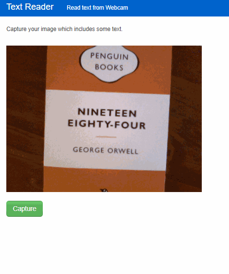

# Text Detection Web App with EAST and Python(flask)

## Overview

This is a simple little web application that captures an image from the camera and detects text in it.



## Technique

An image is captured on the browser, then it is sent to the server. In the server, the image data is firstly input into **EAST text detection DNN model**, which outputs areas detected as text area. Next, each text area is read by **tesseract OCR**. Words interpreted by tesseract OCR are returned to the client and are shown in the list.

- Client side
  - HTML
  - CSS
  - JavaScript
  - JQuery(Ajax)
  - [Twitter Bootstrap 1.4.0](https://getbootstrap.com/1.4.0/)


- Server side
  - Python flask
  - [EAST text detection](https://arxiv.org/pdf/1704.03155v2.pdf)
  - [tesseract OCR](https://github.com/tesseract-ocr/tesseract/blob/master/doc/tesseract.1.asc)


## Required packages

- **Python 3.7**
  - OpenCV 4.1
  - Numpy 1.16
  - pytesseract
  - PIL 6.1


- **tesseract OCR v4**
  - For Ubuntu:
  ```
   $ sudo apt-get install tesseract-ocr
   $ sudo apt-get install libtesseract-dev
   $ sudo apt-get install tesseract-ocr-jpn  # for Japanese language
  ```
  - For Windows:

     Get the installer from https://github.com/UB-Mannheim/tesseract/wiki

- **C++ compiler** (for Ubuntu)

   - build-essential:
   ```
   $ sudo apt-get install build-essential
   ```

## Source

To implement EAST text detection, I highly referred to this GitHub repository : https://github.com/argman/EAST. The following parts in this repo are obtained from there and reused for this project.

- `textdetect/`
  - `lanms/`: For Locality-Aware NMS in Linux (which needs g++)
  - `locality_aware_nms.py`: For Locality-Aware MMS in Windows (when g++ is not available)
  - `restore_rectangle_rbox()` and `restore_rectangle()` in `textdetect.py()`: Copied from `icdar.py` in the sample repo. These functions are used to calculate rectangle coordinates from output of EAST DNN.

Also the frozen model file (`model/frozen_east_text_detection.pb`) was obtained from the following link.
 - https://www.dropbox.com/s/r2ingd0l3zt8hxs/frozen_east_text_detection.tar.gz?dl=1.


## Run

Open a terminal, go to the repository root, then input the following command:
```
python app.py
```

Open a browser, and access **"localhost:5000"**.

## Note

I tested on *Linux(Ubuntu 18.4)* and *Google Chrome(v 79)* in a local network environment. In the case of use which should accept accesses on the internet, it's necessary to setup HTTPS connection, otherwise the web camera won't be accessible.

When I started to think of this project, I was heavily inspired by this tutorial: ["OpenCV OCR and text recognition with Tesseract" in PyImageSearch](https://www.pyimagesearch.com/2018/09/17/opencv-ocr-and-text-recognition-with-tesseract/). I learned a lot from this and related posts. This is one of the greatest blogs and I always go to there when I want to learn something about handling images!
